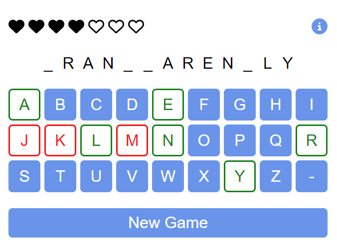
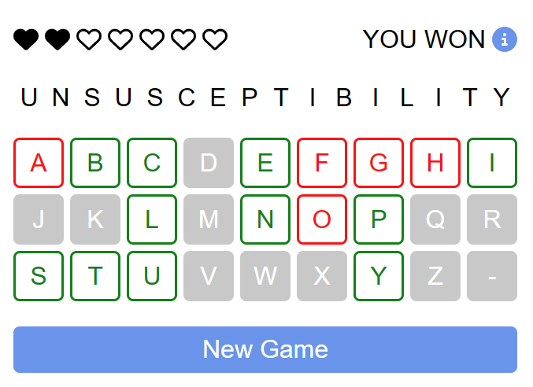

# WebDev Bootcamp Project: Word-Guessing Game
## Live demo
A live demo deployed to GitHub Pages can be found here:

https://YasenBoychev.github.io/webdev-bootcamp-project-word-game

## About
This word-guessing game was a capstone project completed as part of a Web Development Bootcamp.

The application was created with ReactJS and Redux.

### Screenshots:

## Run with npm
To run the app in a development environment with Node Package Manager:
1. Download the main branch of this repository
2. Run `npm install` in the directory containing `package.json` to install the dependencies
3. To start the development server run `npm start`
4. To create a production build run `npm run build`

## Dictionary data
The game uses the dictionary data found in the file `words.json` in `public/data/`. This contains a JSON object where the keys are IDs and the values are the words.

This file was created using the `formatData.js` file in `public/data/` which has to be run separately in a Node.js environment (run with `node ./formatData.js`). `formatData.js` reads the file `dictionary.txt` which contains a list of over 75000 words obtained from WordNet (https://wordnet.princeton.edu/), but can also be set up to read any list of words. `formatData.js` is set up to filter out very short and long words and can also read in a custom list of words (from an external file) to filter out from `dictionary.txt`.

Only the `words.json` file in `public/data/` is needed for the game to run, and the other two files can be removed in a production build.
